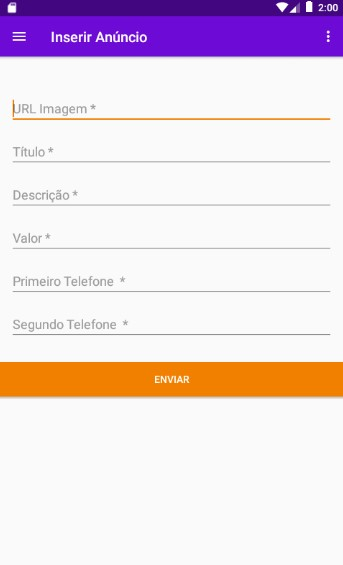

### Projeto OLX Fake

Projeto Kotlin e Laravel 8: OLX Fake 

#### Server 

Verificar na estrutura do arquivo .env 

DB_CONNECTION=mysql  
DB_HOST=127.0.0.1  
DB_PORT=3306  
DB_DATABASE=olxfake  
DB_USERNAME=root  
DB_PASSWORD=  

Após configuração do arquivo .env, executar os comando abaixo.

<b>composer install</b> 
<b>php artisan migrate</b> 
<b>php artisan serve</b>

<b>Estrutura da API</b>

<b>GET</b>: /api/anuncios/listar  
<b>POST</b>: /api/anuncios/store  
<b>GET</b>: /api/categorias/listar  
<b>POST</b>: /api/categorias/store  

#### Aplicativo

Verificar no arquivo <b>olxfake\api\ApiService.kt</b> o retorno do Retrofit, configurar o end point correto.

return Retrofit.Builder() 
            .baseUrl("http://192.168.56.1:8000/") 
            .addConverterFactory(GsonConverterFactory.create()) 
            .client(client) 
            .build() 
            
 ### Screenshot
 
 
 
 
 
 
 
 
 
 
